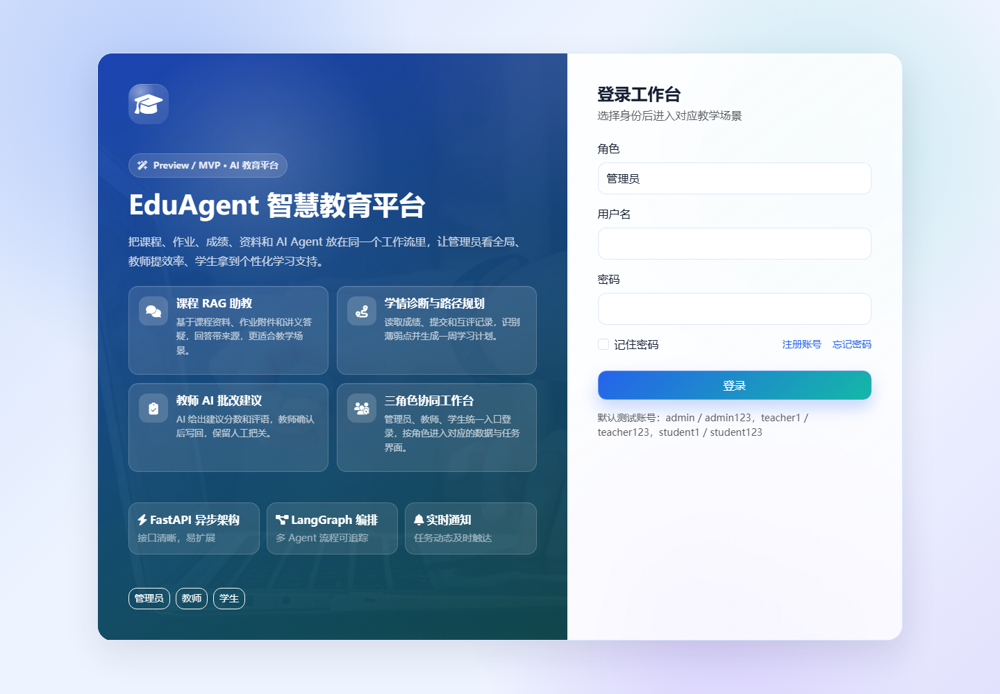
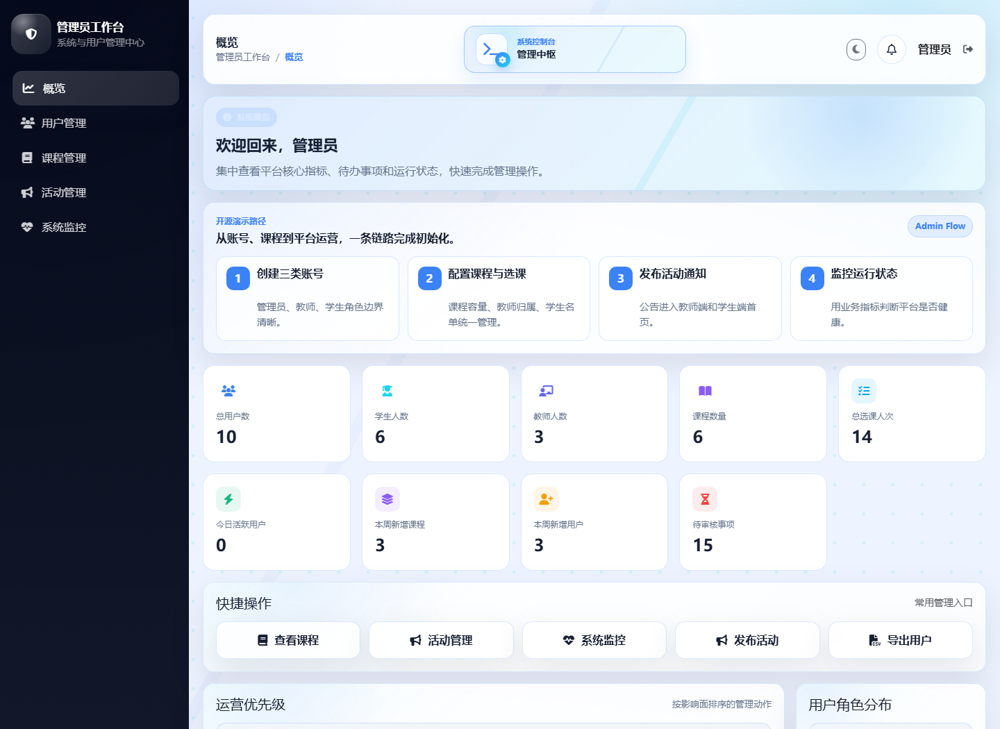
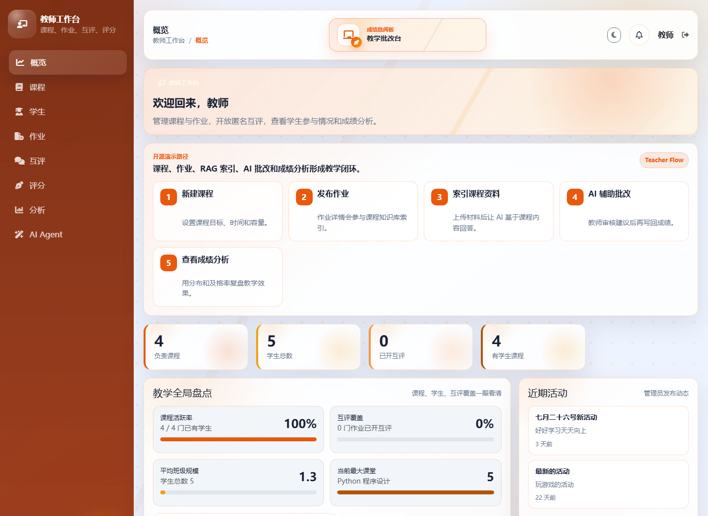
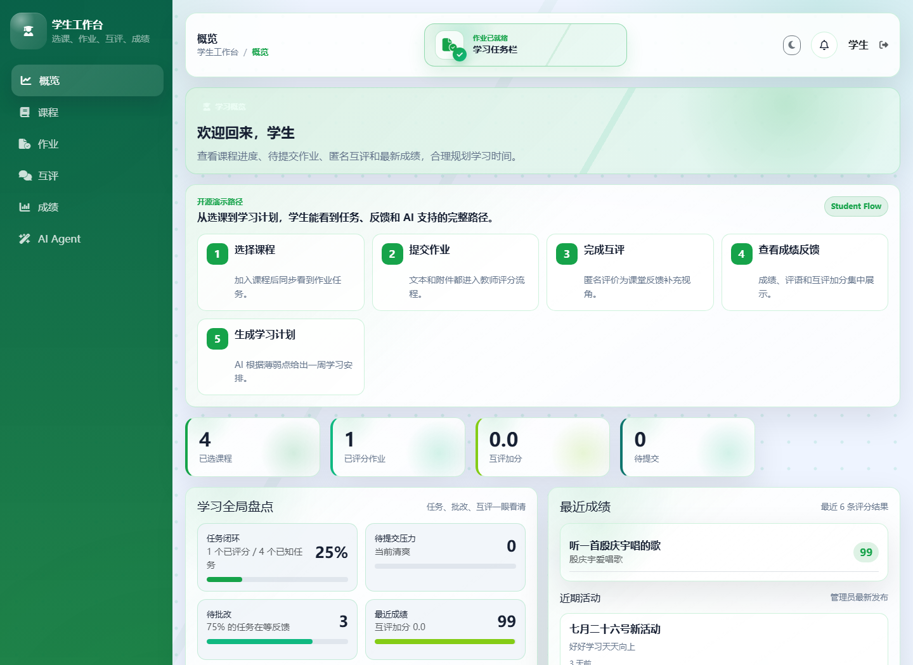

# EduAgent — 基于多 Agent 的智慧教育学习运营平台

> 在原有智慧教育管理系统基础上，将 Java 后端迁移为 Python FastAPI，并引入 LangGraph 多 Agent 工作流，
> 从「记录课程、作业、成绩」升级为「基于课程资料和学习行为进行诊断、答疑、规划、批改和教学建议生成」。

## 项目定位

EduAgent 当前定位为 **AI 教育平台 Preview / MVP**：它已经具备可演示的三角色工作台、课程与作业管理、学生学习任务、匿名互评、AI 学情诊断、课程资料问答和教师 AI 辅助批改闭环。

本项目适合用于开源展示、课程设计、毕业设计原型和 AI 教育产品 MVP 验证。当前版本不建议直接包装为完整生产级教育平台，生产环境仍需要补齐权限审计、密钥管理、文件安全、测试覆盖、监控告警和部署方案。

## 页面预览

| 登录入口 | 管理员工作台 |
| --- | --- |
|  |  |

| 教师工作台 | 学生工作台 |
| --- | --- |
|  |  |

## 架构图


## 技术栈

| 层级 | 技术 | 说明 |
|------|------|------|
| 后端 | FastAPI + SQLAlchemy 2.0 Async | 异步高性能 Web 框架 |
| 数据库 | MySQL 8.0（原 student_db） | 业务数据持久化 |
| 缓存 | Redis | 会话与缓存 |
| 认证 | JWT（兼容原前端） | 无状态认证 |
| AI 编排 | LangGraph | 多 Agent 状态机 |
| AI 组件 | LangChain | LLM 调用与工具集成 |
| 向量库 | Chroma / FAISS | 课程资料语义检索 |
| LLM | OpenAI / 通义千问 / Claude | 可切换的大语言模型 |

## 核心功能

### 1. 课程 RAG 助教
- 课程资料上传、切片、向量索引
- 学生提问时检索课程文档 + 作业附件 + 教师讲义
- 回答必须带引用来源，无资料支撑时明确拒答

### 2. 学情诊断与学习路径规划 Agent
- 读取学生课程、作业、提交、成绩、互评记录
- 识别薄弱点，生成一周学习计划 + 推荐练习
- LangGraph 状态机：collect_profile → analyze_weakness → retrieve_materials → plan_tasks → generate_exercises → validate_plan → save_report

### 3. 教师批改与讲评 Agent
- AI 根据题目要求、学生答案、评分标准给出建议分数和评语
- 教师确认后才写回正式成绩（Human-in-the-loop）
- 评语记忆复用与教学讲评生成

## 当前基线状态

项目已经具备 FastAPI、三角色业务接口、静态前端工作台和 AI 工作流骨架。登录入口已统一，三端均提供演示路径和新用户引导；教师端 AI 批改已从简单长度规则升级为基于作业要求、提交内容、互评和附件状态的本地内容感知建议。

已知限制：

- 完整运行需要 MySQL、Redis；部分 AI 能力需要至少一个可用的 LLM 或本地 Ollama。
- `python scripts/check_baseline.py` 会区分代码错误、核心依赖缺失和可选 AI 依赖缺失。
- 教师 AI 辅助批改当前默认提供稳定的本地内容感知建议，不等同于真实 LLM 自动阅卷。
- RAG、学习计划 Agent、教学建议和部分数据分析能力仍适合作为 Preview/MVP 能力继续迭代。

## 快速启动

```bash
# 1. 克隆项目
git clone <repo-url> edu-ai-platform
cd edu-ai-platform

# 2. 创建并激活虚拟环境（Windows PowerShell）
py -3 -m venv .venv
.venv\Scripts\Activate.ps1

# 3. 安装依赖
python -m pip install --upgrade pip
python -m pip install --index-url https://pypi.tuna.tsinghua.edu.cn/simple -r requirements.txt

# 4. 配置环境变量
cp .env.example .env
# 编辑 .env 填入 MySQL 密码和 LLM API Key

# 5. 执行基线检查
python scripts/check_baseline.py

# 6. 启动服务
python run.py
# 访问 http://localhost:8001/docs 查看 API 文档
```

Linux/macOS 可将虚拟环境路径替换为 `.venv/bin/python`，启动命令仍然是
`python run.py` 或 `.venv/bin/python run.py`。

## 环境变量

| 变量 | 默认值 | 说明 |
|------|--------|------|
| `DB_PASSWORD` | `change-me` | MySQL 密码 |
| `APP_ENV` | `development` | 运行环境 |
| `LOG_LEVEL` | `INFO` | 日志级别 |
| `CORS_ORIGINS` | 本地前端地址 | 允许的前端来源，逗号分隔 |
| `REDIS_HOST` | `localhost` | Redis 地址 |
| `JWT_SECRET` | 示例值 | JWT 签名密钥，生产环境必须修改 |
| `UPLOAD_DIR` | `uploads` | 本地上传目录 |
| `MAX_UPLOAD_SIZE_MB` | `20` | 单文件大小上限 |
| `AI_ENABLED` | `true` | 是否加载 AI 功能 |
| `VECTOR_STORE` | `chroma` | 向量存储实现 |
| `OPENAI_API_KEY` | - | OpenAI API Key（可选） |
| `DASHSCOPE_API_KEY` | - | 通义千问 API Key（可选） |
| `ANTHROPIC_API_KEY` | - | Claude API Key（可选） |

## Demo 账号

| 角色 | 用户名 | 密码 |
|------|--------|------|
| 管理员 | admin | admin123 |
| 教师 | teacher1 | teacher123 |
| 学生 | student1 | student123 |

## 项目结构

```
edu-ai-platform/
├── app/                    # FastAPI 应用
│   ├── main.py             # 入口
│   ├── config.py           # 配置
│   ├── database.py         # 数据库连接
│   ├── models/             # SQLAlchemy 模型
│   ├── schemas/            # Pydantic 序列化
│   ├── routers/            # API 路由
│   │   ├── auth.py         # 认证
│   │   ├── admin.py        # 管理员
│   │   ├── teacher.py      # 教师
│   │   ├── student.py      # 学生
│   │   ├── files.py        # 文件
│   │   └── ai.py           # AI 接口
│   ├── services/           # 业务逻辑
│   ├── middleware/         # 中间件
│   └── utils/              # 工具函数
├── ai/                     # AI 功能模块
│   ├── llm.py              # LLM 配置
│   ├── prompts.py          # 提示词模板
│   ├── rag/                # RAG 模块
│   ├── tools/              # Agent 工具
│   ├── workflows/          # LangGraph 工作流
│   └── evals/              # 评测
├── scripts/                # 工具脚本
├── static/                 # 前端静态文件
├── uploads/                # 上传文件
└── logs/                   # 日志
```

## API 文档

启动服务后访问 http://localhost:8001/docs 查看 Swagger 文档。

### 核心业务接口

| 接口 | 角色 | 功能 |
|------|------|------|
| `POST /api/auth/login` | ALL | 用户登录 |
| `POST /api/auth/register` | ALL | 用户注册 |
| `POST /api/auth/forgot-password` | ALL | 找回密码 |
| `GET /api/admin/users` | ADMIN | 用户管理 |
| `GET /api/admin/dashboard` | ADMIN | 管理后台 |
| `GET /api/teacher/courses` | TEACHER | 我的课程 |
| `POST /api/teacher/courses` | TEACHER | 创建课程 |
| `POST /api/teacher/assignments` | TEACHER | 发布作业 |
| `POST /api/teacher/submissions/{id}/grade` | TEACHER | 批改作业 |
| `GET /api/student/courses` | STUDENT | 可选课程 |
| `GET /api/student/my-courses` | STUDENT | 我的课程 |
| `POST /api/student/enroll/{courseId}` | STUDENT | 选课 |
| `POST /api/student/assignments/{id}/submit` | STUDENT | 提交作业 |
| `GET /api/student/grades` | STUDENT | 我的成绩 |

### 阶段二接口契约

- 所有 JSON 请求体使用后端 Schema 定义的 `snake_case` 字段，例如 `max_students`、`course_id`、`due_date`、`total_points`、`file_path` 和 `file_name`。
- JSON 响应继续由 CamelCase 中间件转换为前端使用的 `camelCase` 字段。请求字段不会由中间件转换。
- 文件上传：`POST /api/files/upload` 返回 `id`、`originalName`、`storagePath`、`size` 和 `contentType`。提交作业时将 `id` 作为 `file_path`，文件名作为 `file_name`；历史提交引用格式为 `id::fileName`。
- 文件预览：`GET /api/files/{file_id}/preview`；文件下载：`GET /api/files/{file_id}/download`。文件不存在或磁盘文件缺失时返回 HTTP `404`。
- 教师互评配置：`POST` 或 `PUT /api/teacher/assignments/{assignment_id}/peer-review`，请求字段包括 `peer_review_enabled`、`peer_review_open_at`、`peer_review_close_at`、`peer_review_required_count`、`peer_review_bonus_per_review`、`peer_review_bonus_cap` 和 `peer_review_prompt`。
- 通知 REST：`GET /api/notifications`、`GET /api/notifications/unread-count`、`PUT /api/notifications/{notification_id}/read`、`PUT /api/notifications/read-all`。
- 通知实时推送：连接 `ws(s)://<host>/ws/notifications?token=<JWT>`。连接成功返回 `CONNECTED`，新通知返回 `NOTIFICATION` 消息。

### AI 接口

| 接口 | 角色 | 功能 |
|------|------|------|
| `POST /api/ai/courses/{course_id}/qa` | ALL | 课程 RAG 问答 |
| `POST /api/ai/students/{student_id}/diagnosis` | SELF/TEACHER | 学情诊断 |
| `POST /api/ai/students/{student_id}/learning-plan` | SELF/TEACHER | 生成学习计划 |
| `POST /api/ai/teacher/submissions/{id}/grade-suggestion` | TEACHER | AI 批改建议 |
| `GET /api/ai/runs/{run_id}` | OWNER/ADMIN | Agent 运行轨迹 |

## Agent 工作流说明

### 学习路径规划 Agent

```
User Input → [收集画像] → [薄弱分析] → [检索资料] → [规划任务] → [生成练习] → [校验] → [保存报告]
```

- **State**: user_id, role, course_id, profile, grades, submissions, weakness, plan, exercises
- **Tool**: 查成绩、查作业、查提交、检索课程资料、生成练习
- **Memory**: 短期 LangGraph State，长期 ai_learning_reports
- **Fallback**: LLM 不可用时返回基于规则的学习建议

### 教师批改 Agent

```
{提交ID} → [读取作业+答案] → [获取评分标准] → [AI 评分] → [等待教师确认] → [写回成绩]
```

- Human-in-the-loop: AI 只生成建议，教师采纳后写回
- 评语记忆：自动保存和复用教师常用评语

## 评测结果

详见 `ai/evals/` 目录。

| 评测项 | 指标 | 状态 |
|--------|------|------|
| RAG 问答 | 引用覆盖率、拒答准确率 | 未完成基线评测 |
| 批改建议 | 平均误差、采纳率 | 未完成基线评测 |
| 学习计划 | 可执行性、资料覆盖 | 未完成基线评测 |

## 开发计划

| 阶段 | 内容 | 状态 |
|------|------|------|
| Phase 0 | 基线、编码、依赖和配置统一 | 进行中 |
| Phase 1 | 认证 + 三角色核心业务接口 | 部分完成 |
| Phase 2 | 文件与课程知识库 | 未开始 |
| Phase 3 | 学生学习 Agent | 骨架已存在，未完成 |
| Phase 4 | 教师批改 Agent | 骨架已存在，未完成 |
| Phase 5 | 评测与交付 | 未开始 |
