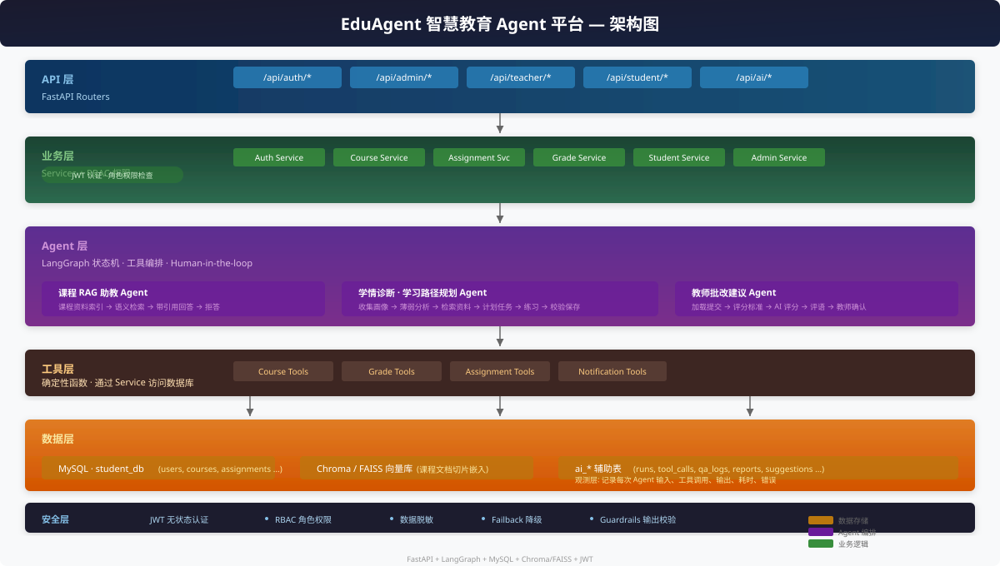

# EduAgent — 基于多 Agent 的智慧教育学习运营平台

> 在原有智慧教育管理系统基础上，将 Java 后端迁移为 Python FastAPI，并引入 LangGraph 多 Agent 工作流，
> 从「记录课程、作业、成绩」升级为「基于课程资料和学习行为进行诊断、答疑、规划、批改和教学建议生成」。

## 架构图



## 技术栈

| 层级 | 技术 | 说明 |
|------|------|------|
| 后端 | FastAPI + SQLAlchemy 2.0 Async | 异步高性能 Web 框架 |
| 数据库 | MySQL 8.0（原 student_db） | 业务数据持久化 |
| 缓存 | Redis | 会话与缓存 |
| 认证 | JWT（兼容原前端） | 无状态认证 |
| AI 编排 | LangGraph | 多 Agent 状态机 |
| AI 组件 | LangChain | LLM 调用与工具集成 |
| 向量库 | Chroma / FAISS | 课程资料语义检索 |
| LLM | OpenAI / 通义千问 / Claude | 可切换的大语言模型 |

## 核心功能

### 1. 课程 RAG 助教
- 课程资料上传、切片、向量索引
- 学生提问时检索课程文档 + 作业附件 + 教师讲义
- 回答必须带引用来源，无资料支撑时明确拒答

### 2. 学情诊断与学习路径规划 Agent
- 读取学生课程、作业、提交、成绩、互评记录
- 识别薄弱点，生成一周学习计划 + 推荐练习
- LangGraph 状态机：collect_profile → analyze_weakness → retrieve_materials → plan_tasks → generate_exercises → validate_plan → save_report

### 3. 教师批改与讲评 Agent
- AI 根据题目要求、学生答案、评分标准给出建议分数和评语
- 教师确认后才写回正式成绩（Human-in-the-loop）
- 评语记忆复用与教学讲评生成

## 快速启动

```bash
# 1. 克隆项目
git clone <repo-url> edu-ai-platform
cd edu-ai-platform

# 2. 安装依赖
pip install -r requirements.txt

# 3. 配置环境变量
cp .env.example .env
# 编辑 .env 填入 MySQL 密码和 LLM API Key

# 4. 启动服务
PYTHONPATH="" .venv/Scripts/python run.py
# 访问 http://localhost:8001/docs 查看 API 文档
```

## 环境变量

| 变量 | 默认值 | 说明 |
|------|--------|------|
| `DB_PASSWORD` | `change-me` | MySQL 密码 |
| `JWT_SECRET` | 内置默认值 | JWT 签名密钥，生产环境必须修改 |
| `OPENAI_API_KEY` | - | OpenAI API Key（可选） |
| `DASHSCOPE_API_KEY` | - | 通义千问 API Key（可选） |
| `ANTHROPIC_API_KEY` | - | Claude API Key（可选） |

## Demo 账号

| 角色 | 用户名 | 密码 |
|------|--------|------|
| 管理员 | admin | admin123 |
| 教师 | teacher1 | teacher123 |
| 学生 | student1 | student123 |

## 项目结构

```
edu-ai-platform/
├── app/                    # FastAPI 应用
│   ├── main.py             # 入口
│   ├── config.py           # 配置
│   ├── database.py         # 数据库连接
│   ├── models/             # SQLAlchemy 模型
│   ├── schemas/            # Pydantic 序列化
│   ├── routers/            # API 路由
│   │   ├── auth.py         # 认证
│   │   ├── admin.py        # 管理员
│   │   ├── teacher.py      # 教师
│   │   ├── student.py      # 学生
│   │   ├── files.py        # 文件
│   │   └── ai.py           # AI 接口
│   ├── services/           # 业务逻辑
│   ├── middleware/         # 中间件
│   └── utils/              # 工具函数
├── ai/                     # AI 功能模块
│   ├── llm.py              # LLM 配置
│   ├── prompts.py          # 提示词模板
│   ├── rag/                # RAG 模块
│   ├── tools/              # Agent 工具
│   ├── workflows/          # LangGraph 工作流
│   └── evals/              # 评测
├── scripts/                # 工具脚本
├── static/                 # 前端静态文件
├── uploads/                # 上传文件
└── logs/                   # 日志
```

## API 文档

启动服务后访问 http://localhost:8001/docs 查看 Swagger 文档。

### 核心业务接口

| 接口 | 角色 | 功能 |
|------|------|------|
| `POST /api/auth/login` | ALL | 用户登录 |
| `POST /api/auth/register` | ALL | 用户注册 |
| `POST /api/auth/forgot-password` | ALL | 找回密码 |
| `GET /api/admin/users` | ADMIN | 用户管理 |
| `GET /api/admin/dashboard` | ADMIN | 管理后台 |
| `GET /api/teacher/courses` | TEACHER | 我的课程 |
| `POST /api/teacher/courses` | TEACHER | 创建课程 |
| `POST /api/teacher/assignments` | TEACHER | 发布作业 |
| `POST /api/teacher/submissions/{id}/grade` | TEACHER | 批改作业 |
| `GET /api/student/courses` | STUDENT | 可选课程 |
| `GET /api/student/my-courses` | STUDENT | 我的课程 |
| `POST /api/student/enroll/{courseId}` | STUDENT | 选课 |
| `POST /api/student/assignments/{id}/submit` | STUDENT | 提交作业 |
| `GET /api/student/grades` | STUDENT | 我的成绩 |

### AI 接口

| 接口 | 角色 | 功能 |
|------|------|------|
| `POST /api/ai/courses/{course_id}/qa` | ALL | 课程 RAG 问答 |
| `POST /api/ai/students/{student_id}/diagnosis` | SELF/TEACHER | 学情诊断 |
| `POST /api/ai/students/{student_id}/learning-plan` | SELF/TEACHER | 生成学习计划 |
| `POST /api/ai/teacher/submissions/{id}/grade-suggestion` | TEACHER | AI 批改建议 |
| `GET /api/ai/runs/{run_id}` | OWNER/ADMIN | Agent 运行轨迹 |

## Agent 工作流说明

### 学习路径规划 Agent

```
User Input → [收集画像] → [薄弱分析] → [检索资料] → [规划任务] → [生成练习] → [校验] → [保存报告]
```

- **State**: user_id, role, course_id, profile, grades, submissions, weakness, plan, exercises
- **Tool**: 查成绩、查作业、查提交、检索课程资料、生成练习
- **Memory**: 短期 LangGraph State，长期 ai_learning_reports
- **Fallback**: LLM 不可用时返回基于规则的学习建议

### 教师批改 Agent

```
{提交ID} → [读取作业+答案] → [获取评分标准] → [AI 评分] → [等待教师确认] → [写回成绩]
```

- Human-in-the-loop: AI 只生成建议，教师采纳后写回
- 评语记忆：自动保存和复用教师常用评语

## 评测结果

详见 `ai/evals/` 目录。

| 评测项 | 指标 | 状态 |
|--------|------|------|
| RAG 问答 | 引用覆盖率、拒答准确率 | - |
| 批改建议 | 平均误差、采纳率 | - |
| 学习计划 | 可执行性、资料覆盖 | - |

## 开发计划

| 阶段 | 内容 | 状态 |
|------|------|------|
| Phase 0 | 工程修复、README、配置统一 | ✅ |
| Phase 1 | 认证 + 三角色核心业务接口 | ✅ |
| Phase 2 | 文件与课程知识库 | 📝 |
| Phase 3 | 学生学习 Agent | 📝 |
| Phase 4 | 教师批改 Agent | 📝 |
| Phase 5 | 评测与包装 | 📝 |
